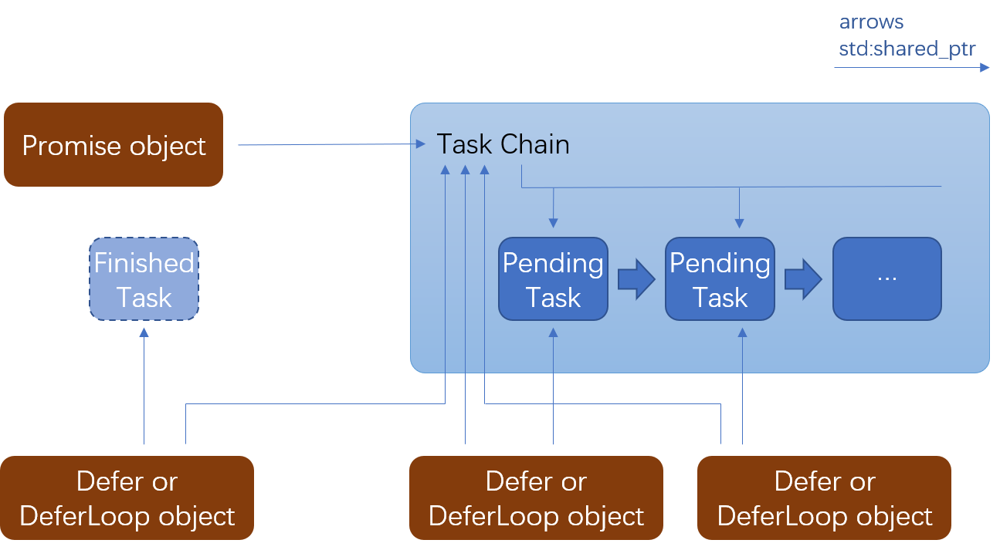

散了吧，cpp20 coroutine了，这么代码已经没有意义 -- 作者

# C++ promise/A+ library in Javascript style.

<!-- TOC -->
  - [What is promise-cpp ?](#what-is-promise-cpp-)
  - [Features](#features)
  - [Examples](#examples)
    - [Examples list](#examples-list)
    - [Compiler required](#compiler-required)
    - [Usage](#usage)
      - [Used as header only library](#used-as-header-only-library)
      - [Used as static library](#used-as-static-library)
      - [Used as shared library](#used-as-shared-library)
      - [Build tips about asio examples](#build-tips-about-asio-examples)
    - [Sample code 1](#sample-code-1)
    - [Sample code 2](#sample-code-2)
  - [Global functions](#global-functions)
    - [Promise newPromise(FUNC func);](#promise-newpromisefunc-func)
    - [Promise resolve(const RET_ARG... &ret_arg);](#promise-resolveconst-ret_arg-ret_arg)
    - [Promise reject(const RET_ARG... &ret_arg);](#promise-rejectconst-ret_arg-ret_arg)
    - [Promise all(const PROMISE_LIST &promise_list);](#promise-allconst-promise_list-promise_list)
    - [Promise race(const PROMISE_LIST &promise_list);](#promise-raceconst-promise_list-promise_list)
    - [Promise raceAndReject(const PROMISE_LIST &promise_list);](#promise-raceandrejectconst-promise_list-promise_list)
    - [Promise raceAndResolve(const PROMISE_LIST &promise_list);](#promise-raceandresolveconst-promise_list-promise_list)
    - [Promise doWhile(FUNC func);](#promise-dowhilefunc-func)
  - [Class Promise - type of promise object](#class-promise---type-of-promise-object)
    - [Promise::then(FUNC_ON_RESOLVED on_resolved, FUNC_ON_REJECTED on_rejected)](#promisethenfunc_on_resolved-on_resolved-func_on_rejected-on_rejected)
    - [Promise::then(FUNC_ON_RESOLVED on_resolved)](#promisethenfunc_on_resolved-on_resolved)
    - [Promise::then(Defer d)](#promisethendefer-d)
    - [Promise::then(DeferLoop d)](#promisethendeferloop-d)
    - [Promise::then(Promise promise)](#promisethenpromise-promise)
    - [Promise::fail(FUNC_ON_REJECTED on_rejected)](#promisefailfunc_on_rejected-on_rejected)
    - [Promise::finally(FUNC_ON_FINALLY on_finally)](#promisefinallyfunc_on_finally-on_finally)
    - [Promise::always(FUNC_ON_ALWAYS on_always)](#promisealwaysfunc_on_always-on_always)
  - [Class Defer - type of callback object for promise object.](#class-defer---type-of-callback-object-for-promise-object)
    - [Defer::resolve(const RET_ARG... &ret_arg);](#deferresolveconst-ret_arg-ret_arg)
    - [Defer::reject(const RET_ARG... &ret_arg);](#deferrejectconst-ret_arg-ret_arg)
  - [Class DeferLoop - type of callback object for doWhile.](#class-deferloop---type-of-callback-object-for-dowhile)
    - [DeferLoop::doContinue();](#deferloopdocontinue)
    - [DeferLoop::doBreak(const RET_ARG... &ret_arg);](#deferloopdobreakconst-ret_arg-ret_arg)
  - [And more ...](#and-more-)
    - [About exceptions](#about-exceptions)
    - [About the chaining parameter](#about-the-chaining-parameter)
    - [Match rule for chaining parameters](#match-rule-for-chaining-parameters)
      - [Resolved parameters](#resolved-parameters)
      - [Rejected parameters](#rejected-parameters)
      - [Omit parameters](#omit-parameters)
    - [Copy the promise object](#copy-the-promise-object)
    - [Life time of the internal storage inside a promise chain](#life-time-of-the-internal-storage-inside-a-promise-chain)
    - [Handle uncaught exceptional or rejected parameters](#handle-uncaught-exceptional-or-rejected-parameters)
    - [about multithread](#about-multithread)
<!-- /TOC -->

## What is promise-cpp ?

Promise-cpp is library that implements promise/A+ standard, which can be the base component in event-looped asynchronized programming. It is NOT std::promise.

## Features

Similar to Javascript Promise API.

Type safety: the resolved/rejected arguments can be captured by the "then" function with same arguments type.

Exceptions supports: cpp exception will be received by the "on_rejected" function.

Optional header-only configuration enabled with the PROMISE_HEADONLY macro

Easy to use, just #include "promise-cpp/promise.hpp" is enough, code based on standard c++11 syntax, no external dependencies required.

Easy to integrate with other libararies (see examples of [asio](example/asio_timer.cpp), [qt](example/qt_timer) and [mfc](example/mfc_timer)).

Useful extended functions on promise object: doWhile, raceAndResolve, raceAndReject

## Examples

### Examples list 

* [example/test0.cpp](example/test0.cpp): a simple test code for promise resolve/reject operations. (no dependencies)

* [example/simple_timer.cpp](example/simple_timer.cpp): simple promisified timer. (no dependencies)

* [example/simple_benchmark_test.cpp](example/simple_benchmark_test.cpp): benchmark test for simple promisified asynchronized tasks. (no dependencies)

* [example/asio_timer.cpp](example/asio_timer.cpp): promisified timer based on asio callback timer. (boost::asio required)

* [example/asio_benchmark_test.cpp](example/asio_benchmark_test.cpp): benchmark test for promisified asynchronized tasks in asio. (boost::asio required)

* [example/asio_http_client.cpp](example/asio_http_client.cpp): promisified flow for asynchronized http client. (boost::asio, boost::beast required)

* [example/asio_http_server.cpp](example/asio_http_server.cpp): promisified flow for asynchronized http server. (boost::asio, boost::beast required)

* [example/qt_timer](example/qt_timer):  promisified timer in QT gui thread. (QT required)

* [example/mfc_timer](example/mfc_timer):  promisified timer in windows MFC gui thread.

Please use cmake to build from [CMakeLists.txt](CMakeLists.txt).

### Compiler required

The library has passed test on these compilers --

* gcc 5

* Visual studio 2015 sp3

* clang 3.4.2

### Usage

#### Used as header only library

To use as header only library, just define macro PROMISE_HEADONLY when compiling.

#### Used as static library

```
cmake /path/to/promise_source
```

#### Used as shared library

```
cmake -DPROMISE_BUILD_SHARED=ON /path/to/promise_source
```

#### Build tips about asio examples

Some of the [examples](example) use boost::asio as io service, and use boost::beast as http service. 
You need to [boost_1_66](https://www.boost.org/doc/libs/1_66_0/more/getting_started/index.html)
 or higher to build these examples.

For examples, you can build with boost library --

```
> cmake -DBOOST_ROOT=/path/to/boost_source /path/to/promise_source
```

### Sample code 1

Example of asio http client. [(full code here)](example/asio_http_client.cpp)

```cpp
int main(int argc, char** argv) {
    // The io_context is required for all I/O
    asio::io_context ioc;

    // Launch the asynchronous operation
    download(ioc, "http://www.163.com/")
    .then([&]() {
        return download(ioc, "http://baidu.com/");
    }).then([&]() {
        return download(ioc, "http://qq.com");
    }).then([&]() {
        return download(ioc, "http://github.com/xhawk18");
    });

    // Run the I/O service. The call will return when
    // the get operation is complete.
    ioc.run();

    return 0;
}
```

### Sample code 2

This sample code shows converting a timer callback to promise object.

```cpp
#include <stdio.h>
#include <boost/asio.hpp>
#include "add_ons/asio/timer.hpp"

using namespace promise;
using namespace boost::asio;

/* Convert callback to a promise */
Promise myDelay(boost::asio::io_service &io, uint64_t time_ms) {
    return newPromise([&io, time_ms](Defer &d) {
        setTimeout(io, [d](bool cancelled) {
            if (cancelled)
                d.reject();
            else
                d.resolve();
        }, time_ms);
    });
}


Promise testTimer(io_service &io) {

    return myDelay(io, 3000).then([&] {
        printf("timer after 3000 ms!\n");
        return myDelay(io, 1000);
    }).then([&] {
        printf("timer after 1000 ms!\n");
        return myDelay(io, 2000);
    }).then([] {
        printf("timer after 2000 ms!\n");
    }).fail([] {
        printf("timer cancelled!\n");
    });
}

int main() {
    io_service io;

    Promise timer = testTimer(io);

    delay(io, 4500).then([=] {
        printf("clearTimeout\n");
        clearTimeout(timer);
    });

    io.run();
    return 0;
}
```

## Global functions

### Promise newPromise(FUNC func);
Creates a new promise object with a user-defined function.
The user-defined functions, used as parameters by newPromise, must have a parameter Defer d. 
for example --

```cpp
return newPromise([](Defer d){
})
```

### Promise resolve(const RET_ARG... &ret_arg);
Returns a promise that is resolved with the given value.
for example --

```cpp
return resolve(3, '2');
```

### Promise reject(const RET_ARG... &ret_arg);
Returns a promise that is rejected with the given arguments.
for example --

```cpp
return reject("some_error");
```

### Promise all(const PROMISE_LIST &promise_list);
Wait until all promise objects in "promise_list" are resolved or one of which is rejected.
The "promise_list" can be any container that has promise object as element type.

> for (Promise &promise : promise_list) { ... }

for example --

```cpp
Promise d0 = newPromise([](Defer d){ /* ... */ });
Promise d1 = newPromise([](Defer d){ /* ... */ });
std::vector<Promise> promise_list = { d0, d1 };

all(promise_list).then([](){
    /* code here for all promise objects are resolved */
}).fail([](){
    /* code here for one of the promise objects is rejected */
});
```

### Promise race(const PROMISE_LIST &promise_list);
Returns a promise that resolves or rejects as soon as one of
the promises in the iterable resolves or rejects, with the value
or reason from that promise.
The "promise_list" can be any container that has promise object as element type.

> for (Promise &promise : promise_list) { ... }

for example --

```cpp
Promise d0 = newPromise([](Defer d){ /* ... */ });
Promise d1 = newPromise([](Defer d){ /* ... */ });
std::vector<Promise> promise_list = { d0, d1 };

race(promise_list).then([](){
    /* code here for one of the promise objects is resolved */
}).fail([](){
    /* code here for one of the promise objects is rejected */
});
```

### Promise raceAndReject(const PROMISE_LIST &promise_list);
Same as function race(), and reject all depending promises object in the list.

### Promise raceAndResolve(const PROMISE_LIST &promise_list);
Same as function race(), and resove all depending promises object in the list.

### Promise doWhile(FUNC func);
"While loop" for promisied task.
A promise object will passed as parameter when call func, which can be resolved to continue with the "while loop", or be rejected to break from the "while loop". 

for example --

```cpp
doWhile([](DeferLoop d){
    // Add code here for your task in "while loop"
    
    // Call "d.doContinue()" to continue with the "while loop",
    
    // or call "d.doBreak()" to break from the "while loop", in this case,
    // the returned promise object will be in resolved status.
});

```

## Class Promise - type of promise object

### Promise::then(FUNC_ON_RESOLVED on_resolved, FUNC_ON_REJECTED on_rejected)
Return the chaining promise object, where on_resolved is the function to be called when 
previous promise object was resolved, on_rejected is the function to be called
when previous promise object was rejected.
for example --

```cpp
return newPromise([](Defer d){
    d.resolve(9567, 'A');
}).then(

    /* function on_resolved */ [](int n, char ch){
        printf("%d %c\n", n, ch);   //will print 9567 here
    },

    /* function on_rejected */ [](){
        printf("promise rejected\n"); //will not run to here in this code 
    }
);
```

### Promise::then(FUNC_ON_RESOLVED on_resolved)
Return the chaining promise object, where on_resolved is the function to be called when 
previous promise object was resolved.
for example --

```cpp
return newPromise([](Defer d){
    d.resolve(9567);
}).then([](int n){
    printf("%d\n", n);  b //will print 9567 here
});
```

### Promise::then(Defer d)
Return the chaining promise object, where d is the callback function be called when 
previous promise object was resolved or rejected.

### Promise::then(DeferLoop d)
Return the chaining promise object, where d is the callback function be called when 
previous promise object was resolved or rejected.

### Promise::then(Promise promise)
Return the chaining promise object, where "promise" is the promise object be called when 
previous promise object was resolved or rejected.

### Promise::fail(FUNC_ON_REJECTED on_rejected)
Return the chaining promise object, where on_rejected is the function to be called when
previous promise object was rejected.

This function is usually named "catch" in most implements of Promise library. 
  https://www.promisejs.org/api/

In promise_cpp, function name "fail" is used instead of "catch", since "catch" is a keyword of c++.

for example --

```cpp
return newPromise([](Defer d){
    d.reject(-1, std::string("oh, no!"));
}).fail([](int err, string &str){
    printf("%d, %s\n", err, str.c_str());   //will print "-1, oh, no!" here
});
```

### Promise::finally(FUNC_ON_FINALLY on_finally)
Return the chaining promise object, where on_finally is the function to be called whenever
the previous promise object was resolved or rejected.

The returned promise object will keeps the resolved/rejected state of current promise object.

for example --

```cpp
return newPromise([](Defer d){
    d.reject(std::string("oh, no!"));
}).finally([](){
    printf("in finally\n");   //will print "in finally" here
});
```

### Promise::always(FUNC_ON_ALWAYS on_always)
Return the chaining promise object, where on_always is the function to be called whenever
the previous promise object was resolved or rejected.

The returned promise object will be in resolved state whenever current promise object is
resolved or rejected.

for example --

```cpp
return newPromise([](Defer d){
    d.reject(std::string("oh, no!"));
}).always([](){
    printf("in always\n");   //will print "in always" here
});
```

## Class Defer - type of callback object for promise object.

### Defer::resolve(const RET_ARG... &ret_arg);
Resolve the promise object with arguments, where you can put any number of ret_arg with any type.
(Please be noted that it is a method of Defer object, which is different from the global resolve function.)
for example --

```cpp
return newPromise([](Defer d){
    //d.resolve();
    //d.resolve(3, '2', std::string("abcd"));
    d.resolve(9567);
})
```

### Defer::reject(const RET_ARG... &ret_arg);
Reject the promise object with arguments, where you can put any number of ret_arg with any type.
(Please be noted that it is a method of Defer object, which is different from the global reject function.)
for example --

```cpp
return newPromise([](Defer d){
    //d.reject();
    //d.reject(std::string("oh, no!"));
    d.reject(-1, std::string("oh, no!"))
})
```

## Class DeferLoop - type of callback object for doWhile.

### DeferLoop::doContinue();
Continue the doWhile loop.

for example --

```cpp
static int *i = new int(0);
doWhile([i](DeferLoop d) {
    if(*i < 10) {
        ++ (*i);
        d.doContinue();
    }
    else {
        d.doBreak(*i);
    }

}).then([](int result) {
    printf("result = %d\n", result);
}).finally([i]() {
    delete i;
})
```

### DeferLoop::doBreak(const RET_ARG... &ret_arg);
Break the doWhile loop (ret_arg will be transferred).

(please see the example above)

## And more ...

### About exceptions
To throw any object in the callback functions above, including on_resolved, on_rejected, on_always, 
will same as d.reject(the_throwed_object) and returns immediately.
for example --

```cpp
return newPromise([](Defer d){
    throw std::string("oh, no!");
}).fail([](string &str){
    printf("%s\n", str.c_str());   //will print "oh, no!" here
});
```
For the better performance, we suggest to use function reject instead of throw.

### About the chaining parameter
Any type of parameter can be used when call resolve, reject or throw, except that the plain string or array.
To use plain string or array as chaining parameters, we may wrap it into an object.

```cpp
newPromise([](Defer d){
    // d.resolve("ok"); may cause a compiling error, use the following code instead.
    d.resolve(std::string("ok"));
})
```

### Match rule for chaining parameters

"then" and "fail" function can accept multiple promise parameters and they follows the below rule --

#### Resolved parameters

Resolved parameters must match the next "then" function, otherwise it will throw an exception and can be caught by the following "fail" function.

#### Rejected parameters

First let's take a look at the rule of c++ try/catch, in which the thrown value will be caught in the block where value type is matched.
If type in the catch block can not be matched, it will run into the default block catch(...) { }.

```cpp
try{
    throw (short)1;
}catch(int a){
    // will not go to here
}catch(short b){
    // (short)1 will be caught here
}catch(...){
    // will not go to here
}
```

"Promise-cpp" implement "fail" chain as the match style of try/catch.

```cpp
newPromise([](Defer d){
    d.reject(3, 5, 6);
}).fail([](std::string str){
    // will not go to here since parameter types are not match
}).fail([](const int &a, int b, int c) {
    // d.reject(3, 5, 6) will be caught here
}).fail([](){
    // Will not go to here sinace previous rejected promise was caught.
});
```

#### Omit parameters

The number of parameters in "then" or "fail" chain can be lesser than that's in resolve function.
```cpp
newPromise([](Defer d){
    d.resolve(3, 5, 6);
}).then([](int a, int b) {
    // d.resolve(3, 5, 6) will be caught here since a, b matched with the resolved parameters and ignore the 3rd parameter.
});
```

A function in "then" chain without any parameters can be used as default promise caught function.
```cpp
newPromise([](Defer d){
    d.resolve(3, 5, 6);
}).then([]() {
    // Function without parameters will be matched with any resolved values,
    // so d.resolve(3, 5, 6) will be caught here.
});
```

The reject parameters follows the the same omit rule as resolved parameters.

### Copy the promise object
To copy the promise object is allowed and effective, please do that when you need.

```cpp
Promise promise = newPromise([](Defer d){});
Promise promise2 = promise;  //It's safe and effective
```

### Life time of the internal storage inside a promise chain

The library uses std::shared_ptr to maintain the internal object of task and task chain.
Resources of a task will be released after the task is finished (in resolved or rejected status) and not obtained by Defer or DeferLoop objects.
Resources of a promise chain will be released when it is not obtained by any Promise, Defer or DeferLoop objects.



### Handle uncaught exceptional or rejected parameters

The uncaught exceptional or rejected parameters are ignored by default. We can specify a handler function to do with these parameters --

```
handleUncaughtException([](Promise &d) {
    d.fail([](int n, int m) {
        //go here if the uncaught parameters match types "int n, int m".
    }).fail([](char c) {
        //go here if the uncaught parameters match type "char c".
    }).fail([]() {
        //go here for all other uncaught parameters.
    });
});
```

### about multithread

This library is thread safe by default. However, it is strongly recommented to use this library on single thread,
especially when you don't clearly know about which thread will runs the chain tasks.

For better performance, we can also disable multithread by adding macro PROMISE_MULTITHREAD=0

